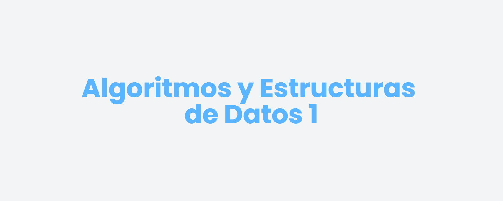

<Generar banner con liyasthomasgithubiobanner>
<Dejar las carreras que correspondan>

 

---

# Contenido
Todo el contenido de este repositorio es de libre acceso y uso. Si deseas contribuir, por favor sigue las [instrucciones de contribución](CONTRIBUTING.md).
## Recursos

- [Notas de Clase](/Notas%20de%20Clase/)
    - [Teórico Práctico](/Notas%20de%20Clase/Teótico%20Práctico/)
    - [Laboratorio](/Notas%20de%20Clase/Laboratorio/)
- [Programación Funcional](/Programación%20Funcional/)
    - [Proyecto 1](/Programación%20Funcional/Proyecto%201/)
        - [Explicación](/Programación%20Funcional/Proyecto%201/Explicación%20Teórica/Proyecto1.pdf)
        - [Solución](/Programación%20Funcional/Proyecto%201/proyecto1.hs)
    - [Proyecto 2](/Programación%20Funcional/Proyecto%202/)
        - [Explicación](/Programación%20Funcional/Proyecto%202/Explicación%20Teórica/Proyecto%202%20-%20Slides.pdf)
        - [Solución](/Programación%20Funcional/Proyecto%202/proyecto2.hs)
    - [Interpretación de Errores](/Programación%20Funcional/Interpretación%20de%20errores/errores.pdf)
    - [Pattern Matching](/Programación%20Funcional/Pattern%20Matching/patternMatching.pdf)
- [Programación Imperativa](/Programación%20Imperativa/)
    - [Proyecto 3](/Programación%20Imperativa/Proyecto%203/)
    - [Proyecto 4](/Programación%20Imperativa/Proyecto%204/)
    - [Arreglos en C](/Programación%20Imperativa/Arreglos%20en%20C/ArraysC.pdf)