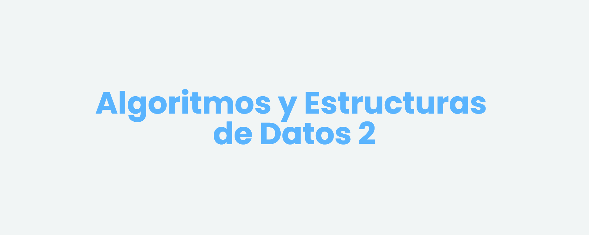

<Generar banner con liyasthomasgithubiobanner>
<Dejar las carreras que correspondan>

  

---

# Algoritmos y Estructuras de Datos II - 2024 
Todo el contenido de este repositorio es de libre acceso y uso. Si deseas contribuir, por favor sigue las [instrucciones de contribución](CONTRIBUTING.md).
## Horarios y modalidad
- Teórico Práctico: Lunes y Miercoles de 14:00 a 18:00 hs.
- Laboratorio: Jueves de 14:00 a 18:00 hs.

## Teórico
1. Introducción al lenguaje de programación del teórico/práctico.
2. Primera parte: Análisis de Algoritmos
    - Ordenación Elemental
    - Ordenación Avanzada
    - Recurrencias y jerarquía de funciones.
3. Segunda parte: Tipos y Estructuras de datos.
    - Tipos Concretos
    - Tipos Abstractos de Datos
    - TADs: Pila y Cola
    - TADs: Árboles binarios.
4. Tercera parte: Técnicas de resolución de problemas.
    - Algoritmos voraces.
    - Algoritmos voraces sobre grafos.
    - Backtracking.
    - Programación dinámica.
5. Recorrida de grafos.

### [Notas Teóricas personales](./Teórico/Apunte/apunte.pdf)
### [Filminas de la cátedra](./Teórico/Filminas%20de%20la%20cátedra/)

## Práctico	
- Primera parte: Análisis de Algoritmos:
    - [Ordenación elemental](./Práctico/Consignas/practico.01.ordenacion.elemental.pdf)
    - [Ordenación avanzada](./Práctico/Consignas/practico.02.ordenacion.avanzada.pdf)
    - [Recurrencias y jerarquía de funciones](./Práctico/Consignas/practico.03.recurrenciasDyV.pdf)
- Segunda parte: Tipos y Estructuras de datos:
    - [Tipos concretos](./Práctico/Consignas/practico.04.tipos.de.datos.pdf)
    - [Tipos Abstractos p1](./Práctico/Consignas/practico.05.tads.pdf)
    - [Tipos Abstractos p2](./)

### [Solucionario de los prácticos](./Práctico/Solucionario%20de%20Prácticos/apunte.pdf)

### Laboratorio
**Notas de Clase** [PDF](./Notas%20de%20Clase/Laboratorio/Source%20code/NotasdeClase.pdf)
- [Lab00](./Laboratorio/Lab00/)
- [Lab01](./Laboratorio/Lab01/)
- [Lab02](./Laboratorio/Lab02/)
- [Lab03](./Laboratorio/Lab03/)
- [Lab04](./Laboratorio/Lab04/)
- [Lab05](./Laboratorio/Lab05/)