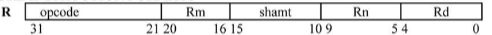
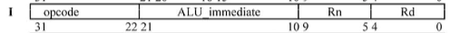
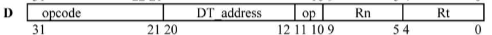
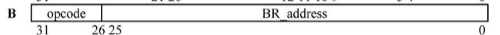
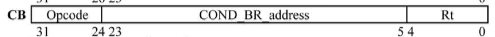
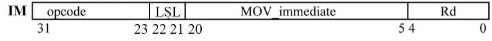

## Instrucciones de tipo `R`
**Las instrucciones de tipo R en LEGv8 son instrucciones que operan en registros.**
### *Core Instruction Set*
- `ADD Rd, Rn, Rm` : Suma el contenido de los registros `Rn` y `Rn` y almacena el resultado en el registro `Rd`.
- `SUB Rd, Rn, Rm`: Resta el contenido del registro `Rm` del registro `Rn` y almacena el resultado en el registro `Rd`.
- `AND Rd, Rn, Rm`: Realiza una operación **AND** bit a bit en los registros `Rn` y `Rm` y almacena el resultado en el registro `Rd`.
- `ORR Rd, Rn, Rm`: Realiza una operación **OR** bit a bit en los registros `Rn` y `Rm` y almacena el resultado en el registro `Rd`.
- `EOR Rd, Rn, Rm`: Realiza una operación **XOR** bit a bit en los registros `Rn` y `Rm` y almacena el resultado en el registro `Rd`.
- `LSL Rd, Rn, <<`: Desplaza los bits en el registro `Rn` a la izquierda por el valor en el `shampt` y almacena el resultado en el registro `Rd`.
- `LSR Rd, Rn, >>`: Desplaza los bits en el registro `Rn` a la derecha por el valor en el `shampt` y almacena el resultado en el registro `Rd`.
### Arithmetic Core Instruction Set
- `FADD Rd, Rn, Rm`: Suma los valores flotantes en los registros `Rn` y `Rm` y almacena el resultado en el registro `Rd`.
- `FDIVS Rd, Rn, Rm`: Divide el valor flotante en el registro `Rn` por el valor flotante en el registro `Rm` y almacena el resultado en el registro `Rd`. La **S** indica que se utilizan números de precisión simple.
- `FDIVD Rd, Rn, Rm`: Similar a FDIVS pero utiliza números de doble precisión.
- `FMULS Rd, Rn, Rm`: Multiplica los valores flotantes en los registros `Rn` y `Rm` y almacena el resultado en el registro `Rd`. La **S** indica que se utilizan números de precisión simple.
- `FMULD Rd, Rn, Rm`: Similar a FMULS pero utiliza números de doble precisión.
- `FSUBS Rd, Rn, Rm`: Resta el valor flotante en el registro `Rm` del registro `Rn` y almacena el resultado en el registro `Rd`. La **S** indica que se utilizan números de precisión simple.
- `FSUBD Rd, Rn, Rm`: Similar a FSUBS pero utiliza números de doble precisión.
- `MUL Rd, Rn, Rm`: Multiplica los valores en los registros `Rn` y `Rm` y almacena el resultado en el registro `Rd`.
- `SDIV Rd, Rn, Rm`: Divide el valor en el registro `Rn` por el valor en el registro `Rm` y almacena el resultado en el registro `Rd`. Esta operación es una división con signo.
- `SMULH Rd, Rn, Rm`: Multiplica los valores en los registros `Rn` y `Rm`, toma la parte alta del resultado y la almacena en el registro `Rd`.
- `STURS Rt, [Rn, #imm]`: Almacena un valor de precisión simple en la memoria en la dirección calculada sumando el valor inmediato a `Rn`.
- `STURD Rt, [Rn, #imm]`: Similar a STURS, pero almacena un valor de doble precisión.
- `UDIV Rd, Rn, Rm`: Divide el valor en el registro `Rn` por el valor en el registro `Rm` y almacena el resultado en el registro `Rd`. Esta operación es una división sin signo.
- `UMULH Rd, Rn, Rm`: Multiplica los valores en los registros `Rn` y `Rm`, toma la parte alta del resultado y la almacena en el registro `Rd`. Esta operación es una multiplicación sin signo.
### Límites 

- `opcode`: ocupa 11 bits,
- `Rm`: el segundo registro operando ocupa 5 bits, es decir toma valores en $[0,2^5)$.
- `shampt`: el valor de desplazamiento ocupa 6 bits, es decir toma valores en $[0,2^6)$.
- `Rn`: el primer registro operando ocupa otros 5 bits, toma valores en $[0,2^5)$.
- `Rd`: el registro de destino ocupa también 5 bits, toma valores en $[0,2^5)$.

## Instrucciones de tipo `I`
**Las instrucciones de tipo I en LEGv8 son instrucciones que operan en un registro y un valor inmediato.**
- `ADDI Rd, Rn, #imm`: Suma el contenido del registro `Rn` y un valor inmediato (*imm*) y almacena el resultado en el registro `Rd`.
- `SUBI Rd, Rn, #imm`: Resta un valor inmediato (*imm*) del contenido del registro `Rn` y almacena el resultado en el registro `Rd`.
- `ANDI Rd, Rn, #imm`: Realiza una operación **AND** bit a bit en el registro `Rn` y un valor inmediato (*imm*) y almacena el resultado en el registro `Rd`.
- `ORRI Rd, Rn, #imm`: Realiza una operación **OR** bit a bit en el registro `Rn` y un valor inmediato (*imm*) y almacena el resultado en el registro `Rd`.
- `EORI Rd, Rn, #imm`: Realiza una operación **XOR** bit a bit en el registro `Rn` y un valor inmediato *(imm)* y almacena el resultado en el registro `Rd`.
### Límites


- `opcode`: ocupa 10 bits,
- `ALU_inmediate`: número no signado de 12 bits, va desde $[0,2^{12})$,
- `Rn` y `Rd`: ocupan 5 bits cada uno se pueden poner desde $X0$ a $X31$.

## Instrucciones de tipo `D`
**Las instrucciones de tipo D en LEGv8 son instrucciones que se utilizan para la carga y almacenamiento de datos.**
- `LDUR Rt, [Rn, #imm]`: Carga el contenido de la memoria en la dirección calculada sumando el valor inmediato (*imm*) al registro `Rn` en el registro de destino `Rt`. LDUR maneja datos de 64 bits.
- `LDURB Rt, [Rn, #imm]`: Similar a LDUR, pero maneja datos de 8 bits (*byte*).
- `LDURH Rt, [Rn, #imm]`: Similar a LDUR, pero maneja datos de 16 bits (*half-word*).
- `LDURSW Rt, [Rn, #imm]`: Carga un valor de 32 bits de la memoria, lo extiende con signo a 64 bits y lo almacena en el registro `Rt`.
- `LDXR Rt, [Rn]`: Carga el contenido de la memoria en la dirección indicada por el registro `Rn` en el registro de destino `Rt` de manera exclusiva. Esta instrucción se utiliza en operaciones atómicas.
- `STUR Rt, [Rn, #imm]`: Almacena el contenido del registro de origen `Rt` en la memoria en la dirección calculada sumando el valor inmediato (*imm*) al registro `Rn`. STUR maneja datos de 64 bits.
- `STURB Rt, [Rn, #imm]`: Similar a STUR, pero maneja datos de 8 bits (*byte*).
- `STURH Rt, [Rn, #imm]`: Similar a STUR, pero maneja datos de 16 bits (*half-word*).
- `STURW Rt, [Rn, #imm]`: Similar a STUR, pero maneja datos de 32 bits (*word*).
- `STXR Rm, Rt, [Rn]`: Almacena el contenido del registro de origen `Rt` en la memoria en la dirección indicada por el registro `Rn` de manera exclusiva. Si la operación es exitosa, se almacena un 0 en el registro de estado `Rm`. Si no es exitosa, se almacena un 1. Esta instrucción se utiliza en operaciones atómicas.

### Límites

- `opcode`: ocupa 11 bits,
- `DT_address`: offset inmediato, ocupa 9 bits y es signado, toma valores en $(-2^8,2^8)$.
- `Rn` y `Rt`: los registros tienen 5 bits cada uno puede tomar desde $0$ a $31$ incluido.

### Ejemplo
Se tiene el siguiente código en *C*:
```c
int main() {
    int arr[5] = {1, 2, 3, 4, 5};
    int sum = 0;
    
    for (int i = 0; i < 5; i++) {
        sum += arr[i];
    }
    
    printf("Suma: %d", sum);
    
    return 0;
}
```

Supongamos que los elementos del arreglo están almacenados desde la dirección de memoria X1 y que X0 es utilizado como el contador y X2 es utilizado para almacenar la suma. 

```asm
MOV X2, #0               // Inicializar suma a 0
MOV X0, #0               // Inicializar contador a 0

loop:
    LDUR X3, [X1, X0]    // Cargar el valor del arreglo en X3
    ADD X2, X2, X3       // Sumar el valor a la suma
    ADDI X0, X0, #8      // Incrementar el contador
    SUBS X4, X0, #40     // Comprobar si hemos leído 5 elementos (5 * 8 bytes = 40 bytes)
    B.NE loop            // Si no, volver al inicio del bucle
```
## Instrucciones de tipo `B` y `CB`
**Las instrucciones de tipo B en LEGv8 son instrucciones de bifurcación (branch), que se utilizan para controlar el flujo del programa. Estas instrucciones cambian el valor del contador de programa (PC) para saltar a diferentes partes del código.**

- `B label`: Salta incondicionalmente al código etiquetado por '*label*'.
- `BL label`: Similar a B, pero también guarda el retorno en el enlace (link register, `LR`), lo que permite retornar a la instrucción siguiente después de la llamada cuando se ejecuta una instrucción de retorno.
- `BR Rn`: Salta incondicionalmente al código en la dirección especificada por el registro `Rn`.
- `CBZ Rn, label`: Salta al código etiquetado por '*label*' si el valor en el registro `Rn` es cero.
- `CBNZ Rn, label`: Salta al código etiquetado por 'label' si el valor en el registro `Rn` no es cero.
- `B.cond label`: Salta al código etiquetado por 'label' si la condición especificada es verdadera. Las condiciones pueden ser EQ (igual), NE (no igual), GT (mayor que), LT (menor que), GE (mayor o igual), LE (menor o igual), etc.
### Límites

- `opcode`: ocupa 6 bits,
- `BR_address`: ocupa 26 bits, signado, toma valores en $(-2^{25}, 2^{25})$.

- `opcode`: ocupa 8  bits,
- `COND_BR_address`: número signado, ocupa 19 bits,
- `Rt`: registro como todos, toma desde $X0$ a $X31$.

### Ejemplo
Se tiene el siguiente código en C:
```c
int main() {
    int arr[5] = {1, 2, 3, 4, 5};
    int sum = 0;
    int i = 0;
    while (sum < 10) {
        sum += arr[i];
        i++;
    }
    return 0;
}
```
Supongamos que los elementos del arreglo están almacenados desde la dirección de memoria X1 y que X0 es utilizado como el contador, X2 es utilizado para almacenar la suma y X3 es utilizado para almacenar el valor actual del arreglo.
```asm
MOV X0, #0               // Inicializar contador a 0
MOV X2, #0               // Inicializar suma a 0

loop:
    LDUR X3, [X1, X0]    // Cargar el valor del arreglo en X3
    ADD X2, X2, X3       // Sumar el valor a la suma
    ADDI X0, X0, #8      // Incrementar el contador
    SUBS X4, X2, #10     // Comprobar si la suma es mayor o igual a 10
    B.LT loop            // Si la suma es menor que 10, volver al inicio del bucle
```

## Instrucciones de tipo `IM`
**Las instrucciones de tipo IM en LEGv8 son instrucciones que operan en un registro y un valor inmediato. Las instrucciones MOVZ y MOVK son parte de este conjunto de instrucciones y se utilizan para mover (cargar) valores inmediatos en un registro.**
- `MOVZ Rd, #imm, LSL #pos`: Mueve el valor inmediato `#imm` al registro `Rd`, pero antes de hacerlo, el valor inmediato se desplaza a la izquierda por la cantidad especificada en `#pos`. El desplazamiento *se realiza en incrementos de 16 bits*, por lo que `#pos` puede ser 0, 16, 32 o 48. La instrucción MOVZ también borra cualquier valor existente en el registro `Rd` antes de mover el nuevo valor.
- `MOVK Rd, #imm, LSL #pos`: Similar a MOVZ, pero en lugar de borrar cualquier valor existente en el registro `Rd`, la instrucción MOVK mantiene el valor existente y solo actualiza los bits especificados por el desplazamiento. Esto permite establecer valores de 16 bits en un registro de 64 bits sin alterar los otros bits.

Por ejemplo, usar MOVZ para cargar un valor en un registro:
```asm
MOVZ X0, #0x1234, LSL #16
```
Esto cargará el valor 0x1234 en el registro X0, pero antes de hacerlo, el valor se desplazará 16 bits a la izquierda, por lo que el valor final en X0 será 0x12340000.
Luego, usar MOVK para modificar algunos de los bits sin cambiar los demás:
```asm
MOVK X0, #0x5678, LSL #0
```
Esto moverá el valor 0x5678 a los bits más bajos de X0, sin cambiar los bits más altos que se establecieron con MOVZ, por lo que el valor final en X0 será 0x12345678.

### Límites


- `opcode`: ocupa 9 bits,
- `LSL`: ocupa 2 bits, lo que quiere decir $00 \rightarrow 0$, $01 \rightarrow 16$, $10 \rightarrow 32$ y $11 \rightarrow 48$.
- `MOV_immediate`: Número no signado de 16 bits, con valor en $[0,2^{16})$.
- `Rd`: registro de destino con 5 bits, va desde $X0$ a $X31$.