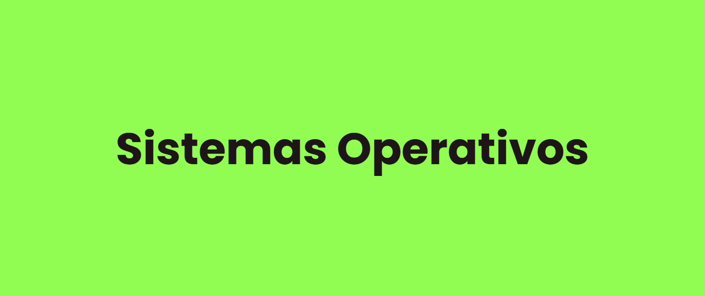

<Generar banner con liyasthomasgithubiobanner>
<Dejar las carreras que correspondan>

 

---

## Material Personal

### Parte I: Virtualización

- [Resumén teórico de la materia, con ejemplos y ejercicios resueltos.](/Apuntes%20teóricos/Parte%20I%20-%20Virtualización/virt.pdf)
- [Prácticos 1 y 2 - Virtualización de CPU y Memoria](/Prácticos%20Resueltos/Prácticos%201%20y%202/Prácticos%201y2.pdf)

### Parte II y III: Concurrencia y Persistencia

- [Resumén teórico de la materia, con ejemplos y ejercicios resueltos.](/Apuntes%20teóricos/Partes%20II%20y%20III%20-%20Concurrencia%20y%20Persistencia/Concurrencia%20y%20Persistencia.pdf)
- [Práctico 3 - Concurrencia](/Prácticos%20Resueltos/Práctico%203/tp3.pdf)
- [Práctico 4 - Persistencia](/Prácticos%20Resueltos/Práctico%204/tp4.pdf)

## Libros Recomendados

- [Advanced Programming in the UNIX Environment](/Libros/Advanced%20Programming%20in%20the%20UNIX%20Enviroment.pdf)
- [Linux with Operating System Concepts](/Libros/Linux%20with%20Operating%20System%20Concepts.pdf)
- [Operating systems internals and design principles](/Libros/Operating%20systems%20internals%20and%20design.pdf)
- [Understanding the Linux Kernel](/Libros/Understanding%20the%20Linux%20Kernel.pdf)
- [Operating System Three Easy Pieces](/Libros/Operating%20Systems%20Three%20Easy%20Pieces.pdf)
- [Computer Systems: A Programmer's Perspective](/Libros/Computer%20Systems%20A%20Programmers%20Perspective.pdf)

## Programa de la Materia

### Parte I: Virtualización
- Procesos
- API de Procesos
- Ejecución directa limitada
- Planificación
- Espacio de Direcciones
- API de Memoria
- El mecanismo de traducción de direcciones
- Segmentación
- Administración del espacio libre
- Paginación
- TLBs
- Archivo de intercambio, mecanismo y política

### Parte II: Concurrencia
- API de hilos
- Candados
- Estructuras de datos sincronizadas
- Variables de condición
- Semáforos
- Problemas típicos de concurrencia

### Parte III: Persistencia
- Dispositivos de Entrada/Salida
- Discos rotacionales
- Archivos y directorios
- Implementación del sistema de archivos
- Localidad y el FFS.
- Consistencia ante caídas, fsck y bitácora
- Sistemas de archivos por bitácora
