---
# Archivos FaMAF
Este repositorio tiene como objetivo consolidar y organizar de manera sistemática el material académico correspondiente a cada asignatura cursada. En él se encuentran recopilados apuntes de clase, presentaciones, tareas, prácticas, ejercicios y cualquier otro recurso didáctico utilizado durante el desarrollo de los respectivos programas de estudio. De esta manera, se constituye un acervo ordenado y de fácil acceso para futuras consultas o revisiones.

# Índice de Contenido
1. [Navegación - Cómo usar el repositorio](#navegación)
2. [Materias](#materias) 

## Navegación
### Acceso rápido a archivos
Para facilitar el acceso a los contenidos, se ha implementado un sistema de navegación intuitivo. Al hacer clic en la imagen representativa de cada material, el usuario será redirigido automáticamente al sitio web específico donde se encuentra alojado el material correspondiente. Esta funcionalidad brinda una experiencia de usuario fluida y eficiente, permitiendo acceder de manera ágil a los recursos académicos requeridos.
### Clonar repositorio
Para obtener una copia local del repositorio en tu máquina, sigue estos pasos:

1. Abre una terminal o línea de comandos.

2. Navega hasta el directorio donde deseas clonar el repositorio.

3. Ejecuta el siguiente comando para clonar el repositorio:

   ```bash
   git clone https://github.com/PedroMVillar/Archivos-FaMAF.git
   ```

Este comando creará una carpeta llamada "Archivos-FaMAF" en el directorio actual, que contendrá una copia local completa del repositorio.

4. Una vez clonado, puedes ingresar a la carpeta del repositorio con el siguiente comando:

   cd Archivos-FaMAF

¡Listo! Ahora tienes una copia local del repositorio en tu máquina y puedes comenzar a trabajar con los archivos.

## Materias
Cada materia cursada se encuentra organizada en una carpeta específica, que contiene todos los recursos académicos correspondientes a la asignatura. A continuación, se presenta un listado de las materias disponibles en el repositorio.

- [Álgebra Lineal - Álgebra II - Álgebra](#algebra-lineal---algebra-ii---algebra)
- [Algoritmos y Estructuras de Datos 1](#algoritmos-y-estructuras-de-datos-1)
- [Algoritmos y Estructuras de Datos 2](#algoritmos-y-estructuras-de-datos-2)
- [Organización del Computador](#organización-del-computador)

---

<div style="text-align:center;">
  <h3>Álgebra Lineal - Álgebra II - Álgebra</h3>
</div>


<div style="text-align:center;">
  <h4>Apuntes - Resúmenes</h4>
</div>

| [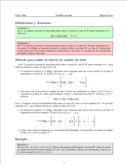](https://github.com/PedroMVillar/Archivos-FaMAF/blob/main/Materias/%C3%81lgebra%20Lineal%20-%20Algebra%20II/Apuntes%20-%20Documentos/Cambio%20de%20Base/cambiodebase.pdf) | [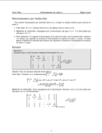](https://github.com/PedroMVillar/Archivos-FaMAF/blob/main/Materias/%C3%81lgebra%20Lineal%20-%20Algebra%20II/Apuntes%20-%20Documentos/Determinantes%20de%20orden%20n/detordenn.pdf) | [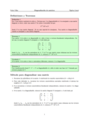](https://github.com/PedroMVillar/Archivos-FaMAF/blob/main/Materias/%C3%81lgebra%20Lineal%20-%20Algebra%20II/Apuntes%20-%20Documentos/Diagonalizaci%C3%B3n/diagonalizacion.pdf) | [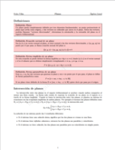](https://github.com/PedroMVillar/Archivos-FaMAF/blob/main/Materias/%C3%81lgebra%20Lineal%20-%20Algebra%20II/Apuntes%20-%20Documentos/Planos/planos.pdf) |
|:---:|:---:|:---:|:---:|
| [Cambio de Base](https://github.com/PedroMVillar/Archivos-FaMAF/blob/main/Materias/%C3%81lgebra%20Lineal%20-%20Algebra%20II/Apuntes%20-%20Documentos/Cambio%20de%20Base/cambiodebase.pdf) | [Determinantes por inducción](https://github.com/PedroMVillar/Archivos-FaMAF/blob/main/Materias/%C3%81lgebra%20Lineal%20-%20Algebra%20II/Apuntes%20-%20Documentos/Determinantes%20de%20orden%20n/detordenn.pdf) | [Diagonalización](https://github.com/PedroMVillar/Archivos-FaMAF/blob/main/Materias/%C3%81lgebra%20Lineal%20-%20Algebra%20II/Apuntes%20-%20Documentos/Diagonalizaci%C3%B3n/diagonalizacion.pdf) | [Planos](https://github.com/PedroMVillar/Archivos-FaMAF/blob/main/Materias/%C3%81lgebra%20Lineal%20-%20Algebra%20II/Apuntes%20-%20Documentos/Planos/planos.pdf) |


<div style="text-align:center;">
  <h4>Ejercicios Resueltos</h4>
</div>

- [Ejercicios de finales y libros varios](https://github.com/PedroMVillar/Archivos-FaMAF/blob/main/Materias/%C3%81lgebra%20Lineal%20-%20Algebra%20II/Ejercicios%20Resueltos/Ejercicios%20de%20finales%20y%20libros%20varios/EjerciciosResueltos-Algebra.pdf)
- [Ejercicios de guías de práctica](https://github.com/PedroMVillar/Archivos-FaMAF/blob/main/Materias/%C3%81lgebra%20Lineal%20-%20Algebra%20II/Ejercicios%20Resueltos/Ejercicios%20de%20gu%C3%ADas/Ejerciciosp2.pdf)


<div style="text-align:center;">
  <h4>Parciales de práctica</h4>
</div>

- [Parcial 1](https://github.com/PedroMVillar/Archivos-FaMAF/blob/main/Materias/%C3%81lgebra%20Lineal%20-%20Algebra%20II/Ex%C3%A1menes%20de%20Pr%C3%A1ctica/Ex1.pdf)
- [Parcial 2](https://github.com/PedroMVillar/Archivos-FaMAF/blob/main/Materias/%C3%81lgebra%20Lineal%20-%20Algebra%20II/Ex%C3%A1menes%20de%20Pr%C3%A1ctica/Ex2.pdf)
- [Parcial 3](https://github.com/PedroMVillar/Archivos-FaMAF/blob/main/Materias/%C3%81lgebra%20Lineal%20-%20Algebra%20II/Ex%C3%A1menes%20de%20Pr%C3%A1ctica/Ex3.pdf)
- [Parcial 4](https://github.com/PedroMVillar/Archivos-FaMAF/blob/main/Materias/%C3%81lgebra%20Lineal%20-%20Algebra%20II/Ex%C3%A1menes%20de%20Pr%C3%A1ctica/Ex4.pdf)


<div style="text-align:center;">
  <h4>Exámenes resueltos paso a paso</h4>
</div>

| [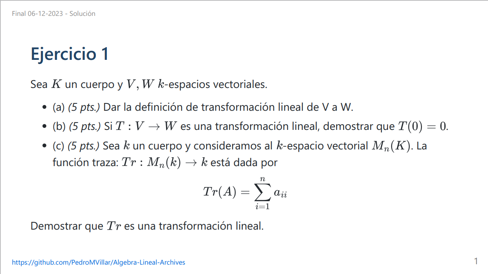](https://github.com/PedroMVillar/Archivos-FaMAF/blob/main/Materias/%C3%81lgebra%20Lineal%20-%20Algebra%20II/Ex%C3%A1menes%20Resueltos/Final%20%C3%81lgebra%2006-12-2023/Final%2006-12-2023%20-%20Soluci%C3%B3n.pdf) | [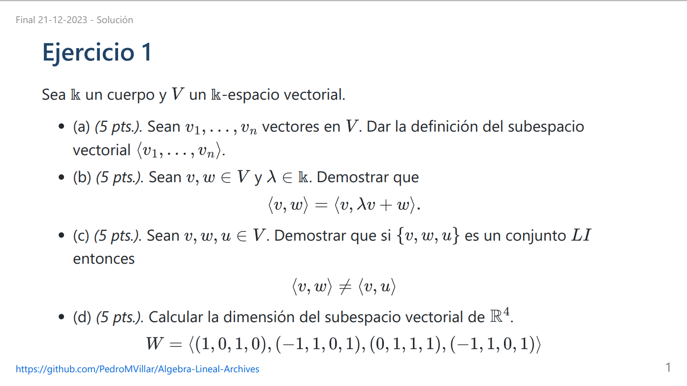](https://github.com/PedroMVillar/Archivos-FaMAF/blob/main/Materias/%C3%81lgebra%20Lineal%20-%20Algebra%20II/Ex%C3%A1menes%20Resueltos/Final%20%C3%81lgebra%2021-12-2023/Final%2021-12-2023%20-%20Soluci%C3%B3n.pdf) |
|:---:|:---:|
| [Final 06-12-2023](https://github.com/PedroMVillar/Archivos-FaMAF/blob/main/Materias/%C3%81lgebra%20Lineal%20-%20Algebra%20II/Ex%C3%A1menes%20Resueltos/Final%20%C3%81lgebra%2006-12-2023/Final%2006-12-2023%20-%20Soluci%C3%B3n.pdf) | [Final 21-12-2023](https://github.com/PedroMVillar/Archivos-FaMAF/blob/main/Materias/%C3%81lgebra%20Lineal%20-%20Algebra%20II/Ex%C3%A1menes%20Resueltos/Final%20%C3%81lgebra%2021-12-2023/Final%2021-12-2023%20-%20Soluci%C3%B3n.pdf) |

| [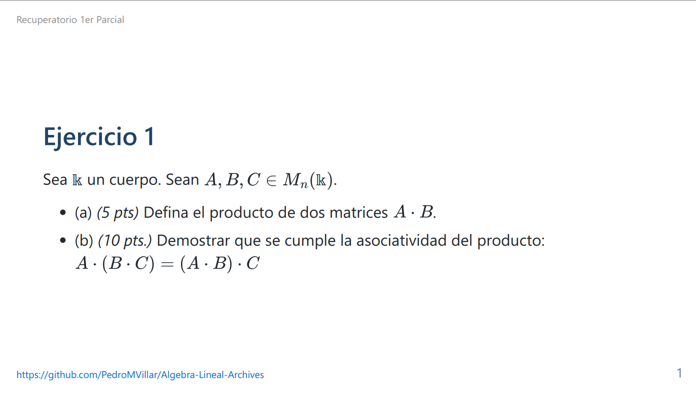](https://github.com/PedroMVillar/Archivos-FaMAF/blob/main/Materias/%C3%81lgebra%20Lineal%20-%20Algebra%20II/Ex%C3%A1menes%20Resueltos/Recuperatorio%201er%20Parcial/Recuperatorio%201er%20Parcial.pdf) | [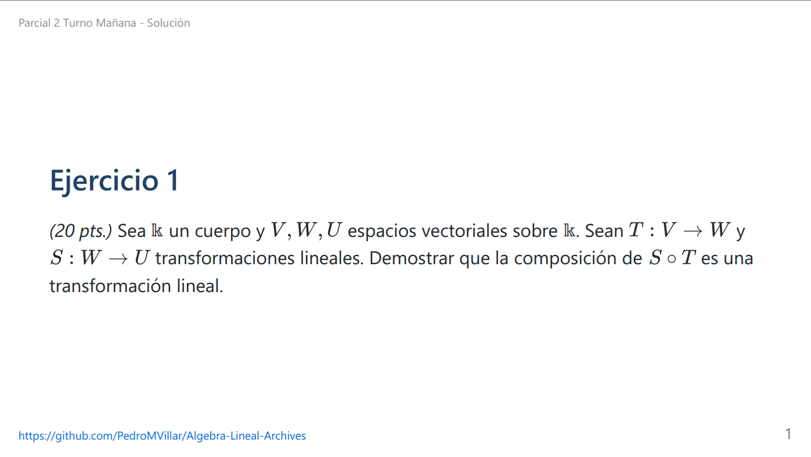](https://github.com/PedroMVillar/Archivos-FaMAF/blob/main/Materias/%C3%81lgebra%20Lineal%20-%20Algebra%20II/Ex%C3%A1menes%20Resueltos/Segundo%20Parcial%20-%20Turno%20Ma%C3%B1ana/2do%20Parcial%20Ma%C3%B1ana.pdf) |
|:---:|:---:|
| [Recuperatorio 1er Parcial](https://github.com/PedroMVillar/Archivos-FaMAF/blob/main/Materias/%C3%81lgebra%20Lineal%20-%20Algebra%20II/Ex%C3%A1menes%20Resueltos/Recuperatorio%201er%20Parcial/Recuperatorio%201er%20Parcial.pdf) | [2do Parcial - Mañana](https://github.com/PedroMVillar/Archivos-FaMAF/blob/main/Materias/%C3%81lgebra%20Lineal%20-%20Algebra%20II/Ex%C3%A1menes%20Resueltos/Segundo%20Parcial%20-%20Turno%20Ma%C3%B1ana/2do%20Parcial%20Ma%C3%B1ana.pdf) |

---

<div style="text-align:center;">
  <h3>Algoritmos y Estructuras de Datos 1</h3>
</div>


<div style="text-align:center;">
  <h4>Apuntes - Resúmenes</h4>
</div>

| [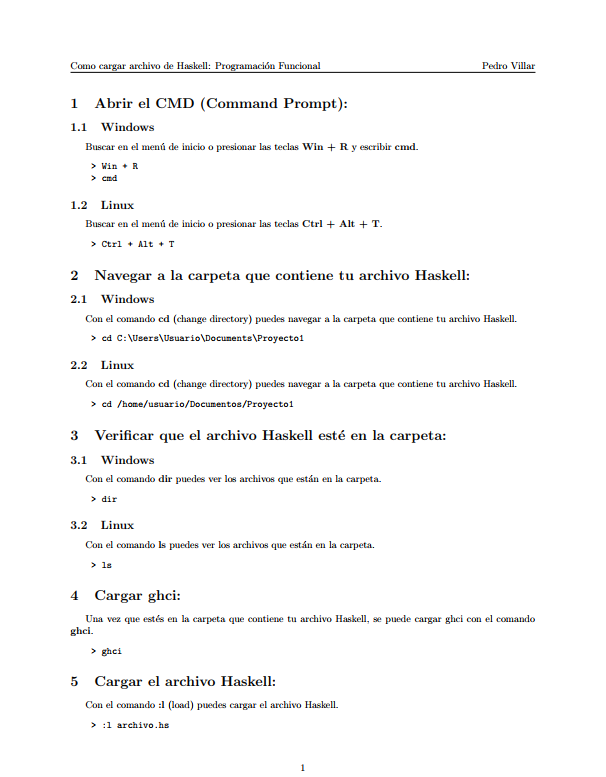](https://github.com/PedroMVillar/Archivos-FaMAF/blob/main/Materias/Algoritmos%20y%20Estructuras%20de%20Datos%201/Programaci%C3%B3n%20Funcional/Compilaci%C3%B3n/compilacion.pdf) | [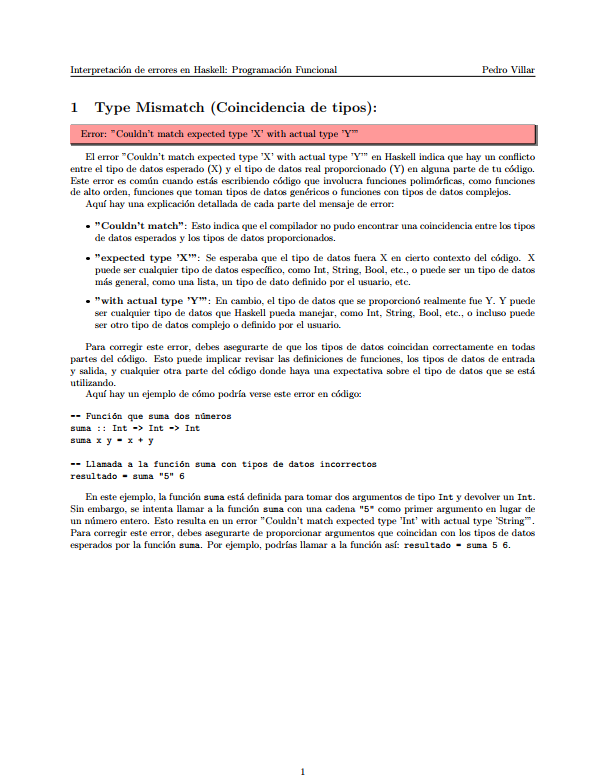](https://github.com/PedroMVillar/Archivos-FaMAF/blob/main/Materias/%C3%81lgebra%20Lineal%20-%20Algebra%20II/Apuntes%20-%20Documentos/Determinantes%20de%20orden%20n/detordenn.pdf) | [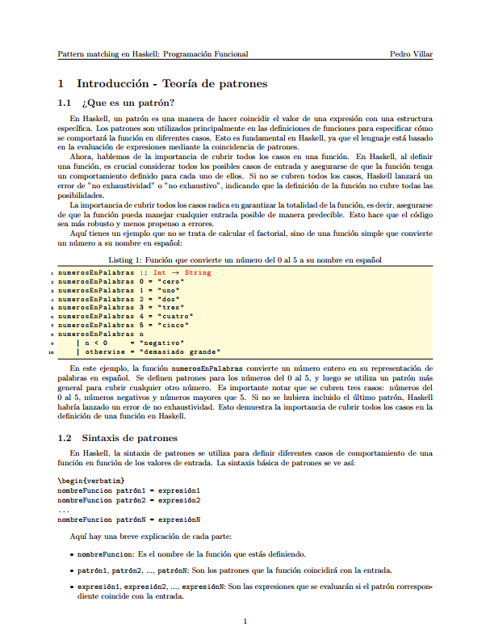](https://github.com/PedroMVillar/Archivos-FaMAF/blob/main/Materias/Algoritmos%20y%20Estructuras%20de%20Datos%201/Programaci%C3%B3n%20Funcional/Pattern%20Matching/patternMatching.pdf) | [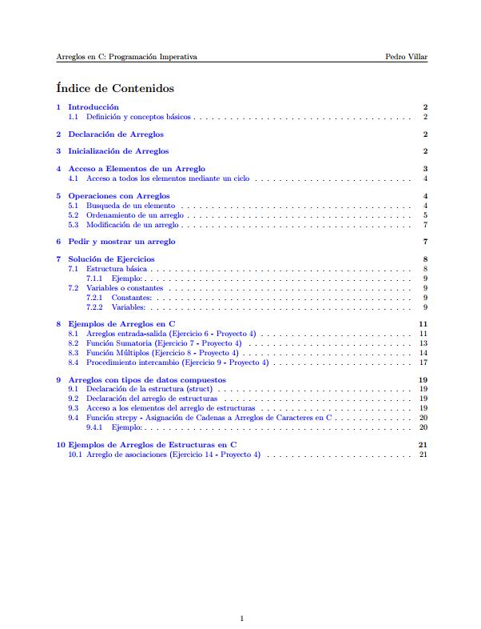](https://github.com/PedroMVillar/Archivos-FaMAF/blob/main/Materias/Algoritmos%20y%20Estructuras%20de%20Datos%201/Programaci%C3%B3n%20Imperativa/Arreglos%20en%20C/ArraysC.pdf) |
|:---:|:---:|:---:|:---:|
| [Compilación](https://github.com/PedroMVillar/Archivos-FaMAF/blob/main/Materias/Algoritmos%20y%20Estructuras%20de%20Datos%201/Programaci%C3%B3n%20Funcional/Compilaci%C3%B3n/compilacion.pdf) | [Interpretación de errores](https://github.com/PedroMVillar/Archivos-FaMAF/blob/main/Materias/Algoritmos%20y%20Estructuras%20de%20Datos%201/Programaci%C3%B3n%20Funcional/Interpretaci%C3%B3n%20de%20errores/errores.pdf) | [Pattern Matching](https://github.com/PedroMVillar/Archivos-FaMAF/blob/main/Materias/Algoritmos%20y%20Estructuras%20de%20Datos%201/Programaci%C3%B3n%20Funcional/Pattern%20Matching/patternMatching.pdf) | [Arreglos en C](https://github.com/PedroMVillar/Archivos-FaMAF/blob/main/Materias/Algoritmos%20y%20Estructuras%20de%20Datos%201/Programaci%C3%B3n%20Imperativa/Arreglos%20en%20C/ArraysC.pdf) |

<div style="text-align:center;">
  <h4>Proyectos</h4>
</div>

- [Proyecto 1](./Materias/Algoritmos%20y%20Estructuras%20de%20Datos%201/Programación%20Funcional/Proyecto%201/)
  - [Código](./Materias/Algoritmos%20y%20Estructuras%20de%20Datos%201/Programación%20Funcional/Proyecto%201/proyecto1.hs)
  - [Explicación](./Materias/Algoritmos%20y%20Estructuras%20de%20Datos%201/Programación%20Funcional/Proyecto%201/Explicación%20Teórica/Proyecto1.pdf)
- [Proyecto 2](./Materias/Algoritmos%20y%20Estructuras%20de%20Datos%201/Programación%20Funcional/Proyecto%202/)
  - [Código](./Materias/Algoritmos%20y%20Estructuras%20de%20Datos%201/Programación%20Funcional/Proyecto%202/Proyecto2.hs)
  - [Explicación](./Materias/Algoritmos%20y%20Estructuras%20de%20Datos%201/Programación%20Funcional/Proyecto%202/Explicación%20Teórica/Proyecto%202%20-%20Slides.pdf)
- [Proyecto 3](./Materias/Algoritmos%20y%20Estructuras%20de%20Datos%201/Programación%20Imperativa/Proyecto%203/Archivos%20C/)
- [Proyecto 4](./Materias/Algoritmos%20y%20Estructuras%20de%20Datos%201/Programación%20Imperativa/Proyecto%204/Archivos%20C/)

---

<div style="text-align:center;">
  <h3>Algoritmos y Estructuras de Datos 2</h3>
</div>


<div style="text-align:center;">
  <h3>Teórico - Práctico</h3>
</div>

[](https://github.com/PedroMVillar/Archivos-FaMAF/blob/main/Materias/Algoritmos%20y%20Estructuras%20de%20Datos%202/Notas%20de%20Clase/Te%C3%B3rico%20Pr%C3%A1ctico/Source%20code/NotasdeClase.pdf)

**Análisis de Algoritmos**
- [Ordenación Elemental](./Materias/Algoritmos%20y%20Estructuras%20de%20Datos%202/Análisis%20de%20Algoritmos/Ordenación%20Elemental/)
  - [Filminas de Clase](./Materias/Algoritmos%20y%20Estructuras%20de%20Datos%202/Análisis%20de%20Algoritmos/Ordenación%20Elemental/01.ordenacion.elemental.pdf)
  - [Práctico 1](./Materias/Algoritmos%20y%20Estructuras%20de%20Datos%202/Análisis%20de%20Algoritmos/Ordenación%20Elemental/Práctico/)
    - [Enunciado](./Materias/Algoritmos%20y%20Estructuras%20de%20Datos%202/Análisis%20de%20Algoritmos/Ordenación%20Elemental/Práctico/practico.01.ordenacion.elemental.pdf)
    - [Solución](./Materias/Algoritmos%20y%20Estructuras%20de%20Datos%202/Análisis%20de%20Algoritmos/Ordenación%20Elemental/Práctico/Solución/tp01sol.pdf)


<div style="text-align:center;">
  <h3>Laboratorio</h3>
</div>

[](https://github.com/PedroMVillar/Archivos-FaMAF/blob/main/Materias/Algoritmos%20y%20Estructuras%20de%20Datos%202/Notas%20de%20Clase/Laboratorio/Source%20code/NotasdeClase.pdf)

> La explicación de los laboratorios esta incluida en las notas de clase.

- [Lab00](./Materias/Algoritmos%20y%20Estructuras%20de%20Datos%202/Laboratorio/Lab00/)
  - [Código](./Materias/Algoritmos%20y%20Estructuras%20de%20Datos%202/Laboratorio/Lab00/Solución/)
  - [Enunciado](./Materias/Algoritmos%20y%20Estructuras%20de%20Datos%202/Laboratorio/Lab00/lab00-2023.pdf)

- [Lab01](./Materias/Algoritmos%20y%20Estructuras%20de%20Datos%202/Laboratorio/Lab01)
  - [Código](./Materias/Algoritmos%20y%20Estructuras%20de%20Datos%202/Laboratorio/Lab01/Solución/)
  - [Enunciado](./Materias/Algoritmos%20y%20Estructuras%20de%20Datos%202/Laboratorio/Lab01/lab01-2023.pdf)

---

<div style="text-align:center;">
  <h3>Organización del Computador</h3>
</div>

[](https://github.com/PedroMVillar/Archivos-FaMAF/blob/main/Materias/Organizaci%C3%B3n%20del%20Computador/Notas%20de%20Clase/Source%20code/NotasdeClase.pdf)

<div style="text-align:center;">
  <h4>Resúmenes Infografías</h4>
</div>

| [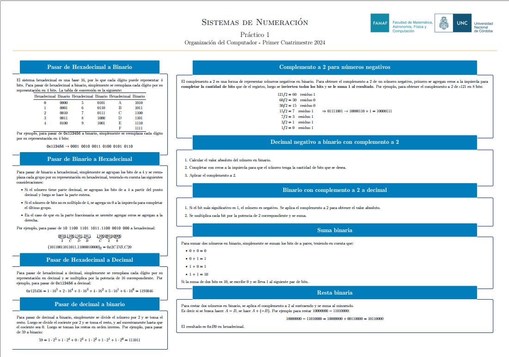](https://github.com/PedroMVillar/Archivos-FaMAF/blob/main/Materias/Organizaci%C3%B3n%20del%20Computador/Sistemas%20de%20Numeraci%C3%B3n/Resumenes/M%C3%A9todos%20para%20Pr%C3%A1ctico%201/main.pdf) | [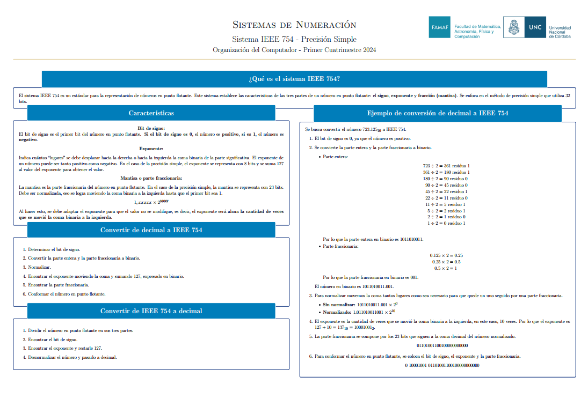](https://github.com/PedroMVillar/Archivos-FaMAF/blob/main/Materias/Organizaci%C3%B3n%20del%20Computador/Sistemas%20de%20Numeraci%C3%B3n/Resumenes/Formato%20IEEE%20754/main.pdf) |
|:---:|:---:|
| [Sistemas de Numeración](https://github.com/PedroMVillar/Archivos-FaMAF/blob/main/Materias/Organizaci%C3%B3n%20del%20Computador/Sistemas%20de%20Numeraci%C3%B3n/Resumenes/M%C3%A9todos%20para%20Pr%C3%A1ctico%201/main.pdf) | [Formato IEEE 754](https://github.com/PedroMVillar/Archivos-FaMAF/blob/main/Materias/Organizaci%C3%B3n%20del%20Computador/Sistemas%20de%20Numeraci%C3%B3n/Resumenes/Formato%20IEEE%20754/main.pdf) |

<div style="text-align:center;">
  <h4>Prácticos Resueltos</h4>
</div>

| [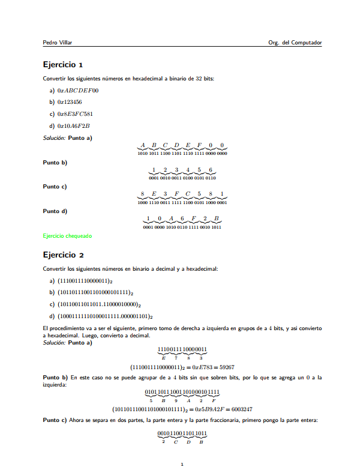](https://github.com/PedroMVillar/Archivos-FaMAF/blob/main/Materias/Organizaci%C3%B3n%20del%20Computador/Sistemas%20de%20Numeraci%C3%B3n/Pr%C3%A1ctico/Soluci%C3%B3n/tp01sol.pdf) | [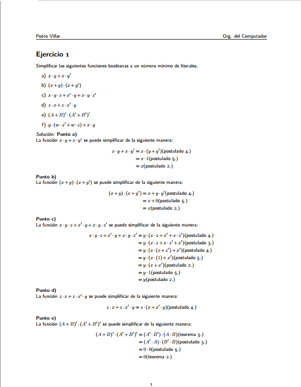](https://github.com/PedroMVillar/Archivos-FaMAF/blob/main/Materias/Organizaci%C3%B3n%20del%20Computador/%C3%81lgebra%20de%20Boole/Pr%C3%A1ctico/Soluci%C3%B3n/tp02sol.pdf) |
|:---:|:---:|
| [Práctico 1 - Corroborado](https://github.com/PedroMVillar/Archivos-FaMAF/blob/main/Materias/Organizaci%C3%B3n%20del%20Computador/Sistemas%20de%20Numeraci%C3%B3n/Pr%C3%A1ctico/Soluci%C3%B3n/tp01sol.pdf) | [Práctico 2](https://github.com/PedroMVillar/Archivos-FaMAF/blob/main/Materias/Organizaci%C3%B3n%20del%20Computador/%C3%81lgebra%20de%20Boole/Pr%C3%A1ctico/Soluci%C3%B3n/tp02sol.pdf) |